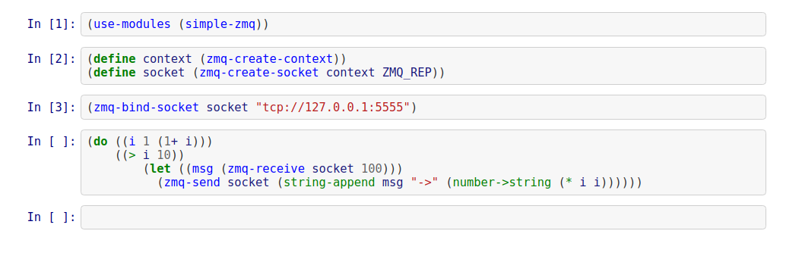
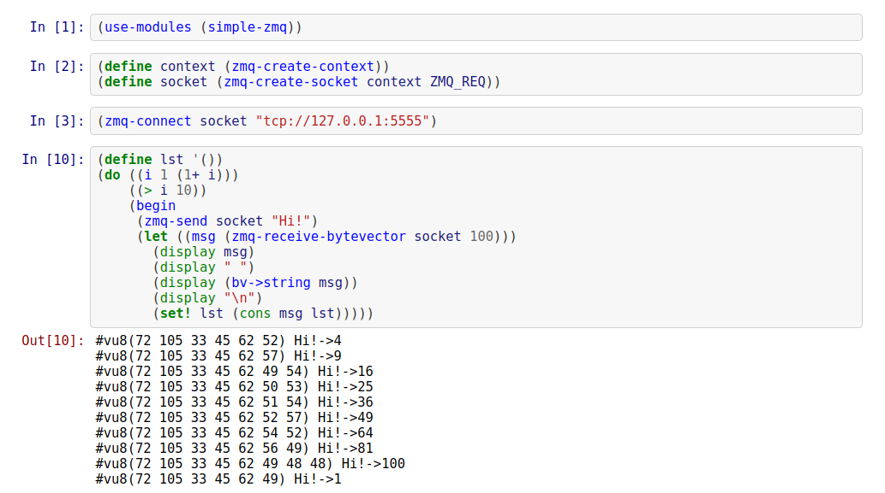

# guile-simple-zmq
The Guile wrapper over ZeroMQ library (Written and tested with GNU Guile 2.0.11)

## Example
A server waits for a client message and answers to it. They are being executed in parallel in the two different Jupyter Notebooks sessions.

The server:

The client:


## Installation
Discover your guile load paths (some help is here: https://www.gnu.org/software/guile/manual/html_node/Load-Paths.html), then put [simple-zmq.scm](src/simple-zmq.scm) to (%library-dir) or to any path from the %load-path list.

I tested it with ZeroMQ-4.2.1:
```
$ wget https://github.com/zeromq/libzmq/releases/download/v4.2.1/zeromq-4.2.1.tar.gz
$ tar xvf zeromq-4.2.1.tar.gz
$ cd zeromq-4.2.1/
$ ./configure
$ make
$ sudo make install
```
